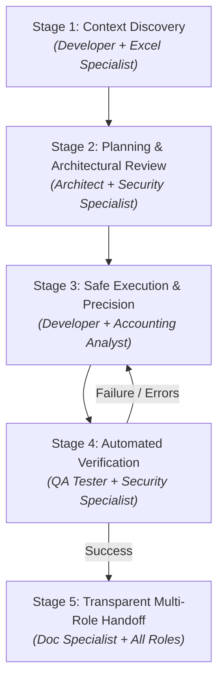

# Standard Operating Procedure (SOP) for AI Assistants & Human Collaboration

## 1. Purpose & Scope

This document defines the standard execution lifecycle and operating rules for AI assistants (Antigravity, GitHub Copilot, Cline, Claude Code, Cursor, etc.) working on the **Excel MCP Server** codebase.

The goal is to ensure:
- Zero regressions in existing Excel and MCP operations.
- Strict adherence to Clean Architecture and enterprise security policies.
- Autonomous verification (type checks, builds, tests) before task handoff.
- Multi-perspective evaluation across software engineering, architecture, testing, financial accounting, cybersecurity, and Excel documentation.
- Clear, predictable communication between human developers and AI assistants.

---

## 2. Assigned Expert Personas & Evaluation Matrix

When handling **any task** (feature development, bug fix, refactor, or code review), the AI assistant MUST operate across **six assigned expert personas**. Every solution and proposal must pass scrutiny under each perspective:

### Role 1: Expert Software Solution Architect
**Domain**: System Design & Modularity
- Enforces Clean Architecture layers: `Types → Services → Facade → Security → Tools`.
- Adheres strictly to Single Responsibility Principle (SRP) and Facade patterns.
- Prevents tight coupling; ensures extensibility and backward compatibility.
- Validates high-level structural decisions before implementation starts.

### Role 2: Senior Software Developer
**Domain**: Implementation & Code Quality
- Strict TypeScript (`strict: true`, ES2022, ESM module resolution, zero unjustified `any`).
- Idiomatic, defensive coding with robust `try / catch` wrapping and descriptive error context.
- Clean naming conventions (`kebab-case.ts`, `PascalCase` classes, `camelCase` methods, `excel_*` tools).
- High runtime performance, memory efficiency, and prevention of resource leaks.

### Role 3: Senior QA & Test Engineer
**Domain**: Reliability & Verification
- Identifies edge cases: empty sheets, merged cells, out-of-bounds ranges, special characters, malformed formulas.
- Validates error paths: invalid paths, unauthorized access, corrupt files.
- Enforces green automated checks (`npm run build`, `npm test`, `npm run lint`).
- Mandates non-regression of existing features.

### Role 4: Financial & Accounting Data Analyst
**Domain**: Domain Math & Financial Precision
- Verifies mathematical accuracy for accounting functions (NPV, IRR, amortizations, depreciation, taxes).
- Enforces standard accounting number formats (e.g., negative in red `#,##0.00;[Red](#,##0.00)`, VND currency format).
- Guards against floating-point rounding errors and division-by-zero.
- Ensures data integrity for financial reconciliations and balance checks.

### Role 5: System Security Specialist
**Domain**: Access Control & Threat Modeling
- Verifies that **all** file operations route unconditionally through `PermissionChecker`.
- Blocks path traversal (`../`), denied paths (`MCP_DENIED_PATHS`), and unwhitelisted extensions.
- Enforces file size limitations (`MCP_MAX_FILE_SIZE`).
- Prevents information leakage: never exposes internal directory structures or system secrets in errors.

### Role 6: Senior Excel & Technical Documentation Specialist
**Domain**: Spreadsheet Domain & Docs
- Deep understanding of Excel specifications (ExcelJS models, styling, fills, fonts, borders, alignments).
- Distinguishes clearly between cell formulas and calculated values.
- Maintains comprehensive, up-to-date documentation in `docs/` and `README.md`.
- Formats user reports with clickable links, structured tables, and clear usage guides.


---

## 3. Core Agent Principles

Every AI assistant operating in this repository must adhere to four immutable rules:

1. **No Blind Modifications**: Never edit, refactor, or delete code without viewing and understanding the file's current contents and its callers first.
2. **Layered Architecture Compliance**: Follow the strict dependency flow:
   `Types → Domain Services → Security → MCP Tool Layer → Server Wiring`
3. **Security Invariance**: File system operations must strictly validate paths, extensions, and file sizes through `PermissionChecker`. Bypassing this is strictly prohibited.
4. **Mandatory Self-Verification**: An operation is not considered complete until `npm run build` and relevant tests pass cleanly with zero compiler warnings or errors.

---

## 4. The 5-Stage Execution Loop

AI assistants must follow this closed-loop workflow for any non-trivial request, evaluating each stage against the assigned expert roles:



### Stage 1: Context Discovery & Impact Analysis *(Developer + Excel Specialist Lens)*
- Inspect [`AGENTS.md`](../AGENTS.md) for project conventions and constraints.
- Locate and read relevant files before modifying them:
  - Check existing interfaces in [`src/types/index.ts`](../src/types/index.ts).
  - Check service logic in [`src/services/`](../src/services/).
  - Check existing tool schemas and handlers in [`src/tools/`](../src/tools/).
- Identify dependencies, potential side effects, and Excel-specific nuances (e.g., cell coordinate bounds, workbook lock state).

### Stage 2: Planning & Architectural Alignment *(Architect + Security Specialist Lens)*
- Formulate a clear, step-by-step implementation plan.
- Perform an **Architectural Pre-Check**:
  - Does the design fit the Clean Architecture layers?
  - Does it keep services decoupled?
- Perform a **Security Pre-Check**:
  - Does any file access touch the filesystem? If so, map its route through `PermissionChecker`.
- Follow the layering order:
  1. Define or update shared types in `src/types/index.ts`.
  2. Implement core business logic in specialized service modules (`src/services/`).
  3. Ensure file access routes through `src/security/permission-checker.ts`.
  4. Register Zod input validation schemas and handlers in `src/tools/`.
  5. Update facade delegates in `src/services/excel-service.ts` if applicable.
- For complex requests or architectural changes, summarize the plan to the user before writing large blocks of code.

### Stage 3: Incremental & Safe Execution *(Developer + Accounting Analyst Lens)*
- Coding conventions:
  - Target: **ES2022**, Module: **ESNext**, ESM syntax (`import`/`export`).
  - Strict TypeScript (`strict: true`, no implicit returns, no unused locals, no arbitrary `any`).
  - Naming: `kebab-case.ts` for files, `PascalCase` for classes, `camelCase` for methods, `snake_case` with `excel_` prefix for tools.
- Financial & Numerical Precision:
  - Guard financial calculations against floating-point inaccuracies and unexpected `NaN`/`null`.
  - Format output values with standard accounting conventions when applicable.
- Error handling:
  - Wrap tool execution in `try / catch` blocks.
  - Return standardized MCP error responses instead of crashing the process.
  - Never leak internal system directory structures in user-facing error messages.

### Stage 4: Automated Verification *(QA Tester + Security Lens)*
- Run automated terminal checks before declaring work done:
  ```bash
  npm run build    # Compiles TypeScript to dist/ — MUST succeed
  npm test         # Runs test suite (if tests exist for the modified unit)
  npm run lint     # Verifies ESLint rules
  ```
- **Edge-case audit**: Verify behavior on empty ranges, non-existent sheets, invalid formats.
- If the build or tests fail, diagnose the compiler output, make corrections, and re-run until all checks pass. Do not ask the user to fix compile issues that you introduced.

### Stage 5: Transparent Handoff & Reporting *(Excel & Documentation Specialist Lens)*
- Provide a concise summary of all changes made.
- Link every modified or created file using clickable markdown links (e.g., `[filename](file:///path/to/file)`).
- Document how to test or trigger the new functionality in MCP clients (e.g., Cline, GitHub Copilot).
- Present output clearly with tables, parameter descriptions, and actionable next steps.

---

## 5. Layering Order for Code Changes

When implementing features or tools, follow this top-down dependency sequence:

| Step | Layer | File Location | Responsibility |
|:---:|:---|:---|:---|
| **1** | **Contracts / Types** | `src/types/index.ts` | All interfaces, types, enums. Centralized; do not scatter. |
| **2** | **Core Logic** | `src/services/excel-*.ts` | ExcelJS operations, calculations, workbook manipulation. |
| **3** | **Facade** | `src/services/excel-service.ts` | Expose methods uniformly to the tool layer. |
| **4** | **Security** | `src/security/permission-checker.ts` | Verify read/write/delete permissions, allowed paths, file size. |
| **5** | **Tool Definition** | `src/tools/definitions/` or `tool-definitions.ts` | Zod schema validation & MCP tool manifest. |
| **6** | **Tool Handler** | `src/tools/handlers/` or `tool-handler.ts` | Dispatch tool calls, invoke service, format response. |
| **7** | **Documentation** | `docs/tools/` & `README.md` | Document parameters, schemas, and usage examples. |

---

## 6. User Prompting Best Practices (C-O-C-V Framework)

For developers issuing tasks to AI assistants, following the **C-O-C-V** pattern ensures optimal, one-shot results:

- **C — Context**: Point to specific files, existing methods, or relevant documentation.
- **O — Objective**: State the exact feature, fix, or refactor needed.
- **C — Constraints**: Specify restrictions (e.g., no external npm dependencies, use `exceljs`, pass `PermissionChecker`).
- **V — Verification**: Instruct the assistant to verify via `npm run build` or `npm test`.

### Example Task Prompts

#### Adding a New Tool
```text
Context: We need a new tool to unmerge cells in a worksheet.
Objective: Implement `excel_unmerge_cells`.
Constraints:
- Add types in src/types/index.ts.
- Add logic in src/services/excel-cell-operations.ts and expose via ExcelService.
- Add Zod schema and tool handler in src/tools/.
- Ensure path validation via PermissionChecker.
Verification: Run `npm run build` to confirm zero TypeScript errors.
```

#### Fixing a Bug
```text
Context: Tool `excel_read_range` throws an error when reading merged cells.
Objective: Handle merged cell reading gracefully by returning the master cell's value.
Constraints: Do not modify the return type signature in src/types/index.ts.
Verification: Build the project and run unit tests.
```

---

## 7. Definition of Done (DoD) — Multi-Role Sign-Off Checklist

A task is considered complete only when all 6 expert roles sign off:

- [ ] **Architect Sign-Off**: Clean Architecture layer separation maintained; no circular dependencies; SRP respected.
- [ ] **Developer Sign-Off**: TypeScript strict mode satisfied; zero unjustified `any`; no unused variables; robust try/catch.
- [ ] **Tester Sign-Off**: `npm run build` passes with zero errors; edge cases and failure paths accounted for.
- [ ] **Accounting Analyst Sign-Off**: Mathematical formulas verified; financial formats adhere to accounting standards; precision preserved.
- [ ] **Security Specialist Sign-Off**: File system access guarded by `PermissionChecker`; no path traversal; no path/secret leakage.
- [ ] **Excel & Docs Specialist Sign-Off**: ExcelJS models and cell semantics correctly applied; `docs/` and `README.md` updated with clear examples.

---

## 8. Related Documents

- [PROJECT_AUDIT_REPORT.md](PROJECT_AUDIT_REPORT.md) — Comprehensive 6-role project audit report & roadmap.
- [ARCHITECTURE.md](ARCHITECTURE.md) — System architecture, Clean Architecture layers & patterns.
- [SECURITY.md](SECURITY.md) — Security model, permission checking & path access policies.
- [API.md](API.md) — Full API reference.
