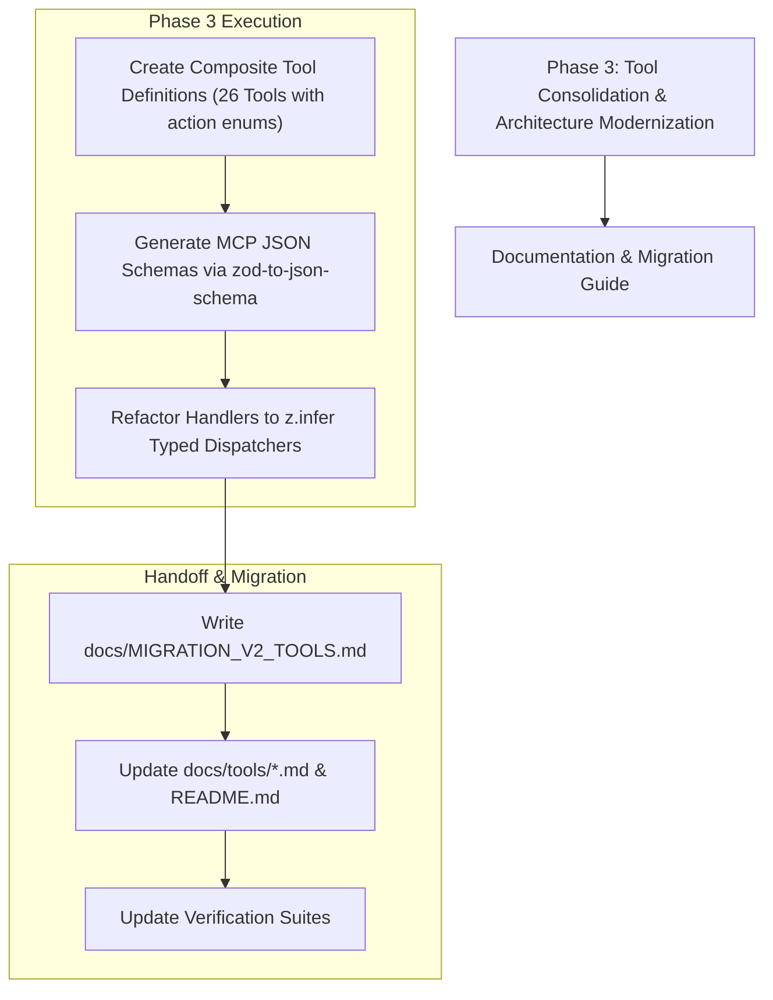

# Excel MCP Server — Active Project Audit & Roadmap Report

> **Evaluation Date**: October 2026  
> **Status**: Core Security, Mathematical, Validation, Canonical Paths & Encapsulation Resolved  
> **Evaluation Framework**: 6 Assigned Expert Personas ([docs/AI_WORKFLOW.md](AI_WORKFLOW.md))  
> **Target Audience**: AI Assistants (GitHub Copilot, Cline, Antigravity, Claude, ChatGPT), Lead Architects, and Developers.

---

## Executive Summary & Scorecard

Following remediation across Phase 1, Phase 2, and the foundational hardening steps (canonical path key management, sub-service encapsulation, zero-rate amortization guard, and default-deny containment), all foundational code-level defects have been resolved. The test suite now passes **129 tests across 8 test suites** with zero compiler or linter errors.

This document tracks the **sole remaining active architectural task** required to achieve full production readiness: **Phase 3 Tool Consolidation**.

### Active Status Scorecard

| Persona Lens | Domain | Current Status | Remaining Action Item |
| :--- | :--- | :---: | :--- |
| **Role 1: Solution Architect** | System Design & Modularity | ⚠️ PENDING CONSOLIDATION | Execute Phase 3 blueprint: Consolidate 127 granular tools into 26 composite tools ([PHASE3_CONSOLIDATION_PLAN.md](PHASE3_CONSOLIDATION_PLAN.md)). |
| **Role 2: Senior Software Developer** | Code Quality & Architecture | 🟢 CLEAN | Facade encapsulation complete (sub-services private, typed accessors in place). Zero ESLint / TS warnings. |
| **Role 3: Senior QA & Test Engineer** | Testing & Verification | 🟢 STABLE (129 TESTS PASSING) | Maintain test coverage as Phase 3 composite tools are introduced. |
| **Role 4: Financial & Accounting Analyst** | Mathematical Correctness | 🟢 STABLE | Zero-rate amortization guard implemented & tested. IRR/NPV/Aging verified. |
| **Role 5: System Security Specialist** | Access Control & Security | 🟢 HARDENED | Canonical paths, strict path traversal guards, and default-deny containment (`allowedPaths: [process.cwd()]`) active. |
| **Role 6: Senior Excel & Doc Specialist** | Excel Domain & Docs | 🟡 PENDING DOCS OVERHAUL | Overhaul documentation and tool catalogs once composite tools (Phase 3) are merged. |

---

## Active Findings & Next Actions

---

### 🏛️ Role 1: Expert Software Solution Architect

#### Active Finding 1.1: Context Window Bloat via 127 Granular Tools (HIGH)
- **Current State**:
  All 127 defined tools are currently active and dispatched. While fully functional, sending 127 tool schemas in `ListToolsRequest` imposes ~38,000 tokens of overhead on every client session, slowing response latency and increasing tool selection confusion for LLMs.
- **Action Plan**:
  Execute the approved blueprint in [docs/PHASE3_CONSOLIDATION_PLAN.md](PHASE3_CONSOLIDATION_PLAN.md) to merge 127 tools into **26 composite tools** using `action` enums.
  - Expected token reduction: ~75% (~38k down to ~7–9k tokens).
  - Target: Dedicated migration session with backward compatibility or migration guide.

---

## Actionable Execution Roadmap (Remaining Work)



---

## Current Verification Status

Run these commands to verify the current health of the codebase:

```bash
# 1. Run all 129 automated tests across 8 test suites
npm test

# 2. Verify ESLint compliance (zero errors)
npm run lint

# 3. Verify TypeScript build compilation (zero errors)
npm run build

# 4. Check active tool count (127 live tools)
node -e "import('./dist/tools/tool-definitions.js').then(m => console.log('Tools count:', m.TOOL_DEFINITIONS.length))"
```
