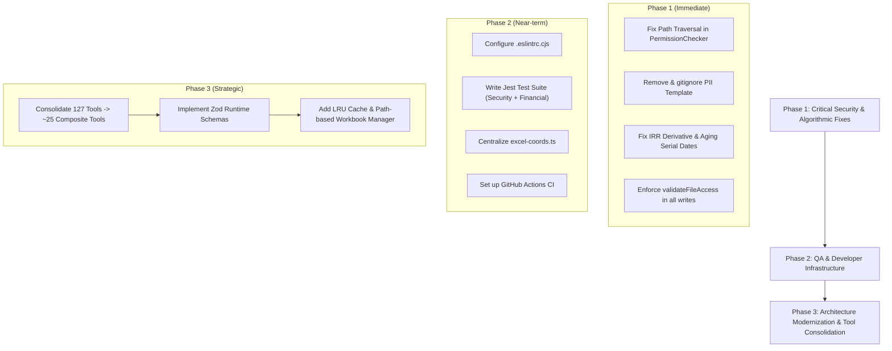

# Excel MCP Server — Comprehensive Project Audit Report

> **Evaluation Date**: October 2026  
> **Evaluation Framework**: 6 Assigned Expert Personas ([docs/AI_WORKFLOW.md](AI_WORKFLOW.md))  
> **Target Audience**: AI Assistants (GitHub Copilot, Cline, Antigravity, Claude, ChatGPT), Lead Architects, and Developers.

---

## Executive Summary & Scorecard

This audit evaluates the **Excel MCP Server** codebase against enterprise production readiness across all six assigned expert domains. While the project presents a clean directory structure and substantial ExcelJS wrapper coverage (127 tools), critical vulnerabilities and architectural blockers were identified that currently prevent safe production deployment.

### Evaluation Scorecard

| Persona Lens | Domain | Status | Key Blocker / Risk |
| :--- | :--- | :---: | :--- |
| **Role 1: Solution Architect** | System Design & Modularity | ⚠️ NEEDS REFACTOR | 127 flat tools congest LLM context window (~38k tokens); memory leaks in `Map<string, Workbook>`; encapsulation leaks. |
| **Role 2: Senior Software Developer** | Code Quality & TypeScript | ⚠️ MODERATE RISK | `npm run lint` fails (missing ESLint config); Zod runtime validation completely missing; `args: any` in 2 of 15 handler files (all financial handlers). |
| **Role 3: Senior QA & Test Engineer** | Testing & Verification | ❌ CRITICAL FAILURE | **0 test files** exist in repository (`npm test` exits with code 1); zero CI/CD pipeline; zero regression coverage. |
| **Role 4: Financial & Accounting Analyst** | Mathematical Correctness | ❌ ALGORITHMIC DEFECT | Newton-Raphson derivative mathematically wrong for IRR; Aging Report skips Excel serial dates; floating-point precision hazards. |
| **Role 5: System Security Specialist** | Access Control & Security | ❌ CRITICAL VULNERABILITY | Path Traversal (`../`) unhandled in `PermissionChecker`; Default-Allow when config empty; unvalidated file write operations; real employee PII file tracked in git. |
| **Role 6: Senior Excel & Doc Specialist** | Excel Domain & Docs | ⚠️ NEEDS ALIGNMENT | ExcelJS lacks built-in formula engine (returns `undefined` results); `exportWorksheetToNewFile` strips all formats/formulas; doc-to-code divergence. |

---

## Detailed Findings by Assigned Expert Persona

---

### 🛡️ Role 5: System Security Specialist Lens
*Assigned Domain: Permission Enforcement, Access Control, Vulnerability Mitigation, Data Privacy.*

#### Finding 5.1: Path Traversal (`../`) Vulnerability in `PermissionChecker` (CRITICAL)
- **File**: [`src/security/permission-checker.ts`](../src/security/permission-checker.ts#L157-L176)
- **Vulnerability**:
  ```typescript
  private normalizePath(filePath: string): string {
    return filePath.replace(/\\/g, '/').toLowerCase();
  }
  ```
  The method performs string replacement without canonicalizing the path via `path.resolve()` or `path.normalize()`.
  If an allowed path is `/workspace/project`, a payload like `/workspace/project/../../etc/passwd` or `/workspace/project/../../secret.xlsx` passes `filePath.startsWith(normalizedPattern + '/')` despite escaping the sandbox.
- **Remediation**:
  Use `path.resolve(filePath)` and verify that the canonical target path starts with the canonical allowed directory path (`canonicalPath.startsWith(canonicalAllowedDir + path.sep)`).

#### Finding 5.2: Fail-Open Security Default When `allowedPaths` Is Empty (HIGH)
- **File**: [`src/security/permission-checker.ts`](../src/security/permission-checker.ts#L32-L35)
- **Vulnerability**:
  ```typescript
  if (this.config.allowedPaths.length === 0) {
    // If no allowed paths specified, allow all (except denied)
    return { success: true, data: true };
  }
  ```
  This implements a **Default-Allow** architecture instead of **Default-Deny (Zero Trust)**. If an administrator fails to configure `MCP_ALLOWED_PATHS`, any client can read and write arbitrary files anywhere on the host operating system.
- **Remediation**:
  Default to allowing only `process.cwd()` when `allowedPaths` is unconfigured, or fail closed (`return { success: false, error: 'No allowed paths configured' }`).

#### Finding 5.3: Security Checks Completely Bypassed in File Writing Services (HIGH)
- **Files**:
  - [`src/services/excel-workbook-manager.ts`](../src/services/excel-workbook-manager.ts#L161-L195) (`exportWorksheetToNewFile`)
  - [`src/services/excel-workbook-manager.ts`](../src/services/excel-workbook-manager.ts#L71-L88) (`createWorkbook`)
- **Vulnerability**:
  - `exportWorksheetToNewFile` performs **zero validation**: it never checks `hasPermission('write')`, never calls `isPathAllowed(newFilePath)`, and never calls `isExtensionAllowed(newFilePath)`. It writes directly using `newWorkbook.xlsx.writeFile(newFilePath)`.
  - `createWorkbook` only checks `hasPermission('write')` but completely skips path containment and extension checks before executing `workbook.xlsx.writeFile(filename)`.
- **Remediation**:
  Enforce `validateFileAccess(targetPath, 0, 'write')` on every method that creates, writes, or exports files.

#### Finding 5.4: Corporate Employee Account PII Tracked in Git Repository (CRITICAL)
- **File**: [`Template_Pinaco_DS Nhân viên-Account_260226.xlsx`](../Template_Pinaco_DS%20Nha%CC%82n%20vie%CC%82n-Account_260226.xlsx)
- **Issue**:
  A 36KB Excel file containing 215 rows and 14 columns of actual corporate employee account data ("Pinaco DS Nhân viên-Account") is currently committed and tracked in git.
- **Remediation**:
  Remove the file from git history (`git rm --cached`), add it to `.gitignore`, and provide sanitized mock data in `tests/fixtures/sample.xlsx`.

---

### 📈 Role 4: Financial & Accounting Data Analyst Lens
*Assigned Domain: Mathematical Accuracy, Financial Formulas, Rounding, Auditability.*

#### Finding 4.1: Mathematical Error in IRR Newton-Raphson Derivative (CRITICAL)
- **File**: [`src/services/excel-advanced-accounting.ts`](../src/services/excel-advanced-accounting.ts#L120-L130)
- **Vulnerability**:
  ```typescript
  for (let j = 0; j < values.length; j++) {
    npv += values[j] / Math.pow(1 + rate, j + 1);
    dnpv -= (j * values[j]) / Math.pow(1 + rate, j + 1); // MATHEMATICAL BUG
  }
  ```
  1. For $f(r) = \sum_{j=0}^{n-1} \frac{v_j}{(1+r)^{j+1}}$, the first derivative is $f'(r) = \sum_{j=0}^{n-1} -(j+1)\frac{v_j}{(1+r)^{j+2}}$.
  2. The code multiplies by `j` instead of `j + 1`, which nullifies the derivative contribution of the first cashflow (`0 * values[0] = 0`).
  3. The denominator remains $(1+r)^{j+1}$ instead of $(1+r)^{j+2}$.
  4. In financial cash flows, initial investment $CF_0$ occurs at $t=0$ (undiscounted: $\frac{CF_0}{(1+r)^0} = CF_0$), whereas here all flows are discounted starting from $t=1$.
  5. The loop fails to check for non-convergence or `dnpv === 0` (division by zero yielding `NaN` or `Infinity`), returning bogus rates silently.
- **Remediation**:
  Implement standard financial IRR formula with verified derivative, support $t=0$ for initial outlay, and check convergence tolerance with fallback.

#### Finding 4.2: Aging Report Ignores Standard Excel Serial Dates (HIGH)
- **File**: [`src/services/excel-advanced-accounting.ts`](../src/services/excel-advanced-accounting.ts#L323-L325)
- **Vulnerability**:
  ```typescript
  if (!(dateValue instanceof Date)) {
    continue;
  }
  ```
  Excel files natively store dates as floating-point numbers (serial dates, e.g. `45371` for 2024-03-22) or ISO strings. The strict `instanceof Date` check drops all serial dates and string dates without warning, producing an empty or understated Accounts Receivable/Payable aging report.
- **Remediation**:
  Support conversion of Excel serial numbers and date strings into JavaScript `Date` objects before calculating aging buckets.

#### Finding 4.3: Multi-Column Sum & Average Range Truncation (HIGH)
- **File**: [`src/services/excel-accounting.ts`](../src/services/excel-accounting.ts#L60-L76)
- **Vulnerability**:
  When calculating sums or averages over multi-column ranges (such as `A1:C10`), the implementation executes:
  ```typescript
  const targetColIndex = this.getColumnIndex(rangeStart, rangeStart.match(/^([A-Z]+)/)![1]);
  ```
  It extracts only the starting column (column `A`) and ignores all subsequent columns (`B` and `C`).
- **Remediation**:
  Iterate through all columns between `range.start.column` and `range.end.column`.

#### Finding 4.4: Floating-Point Rounding & Division Hazards (MEDIUM)
- **Files**: [`src/services/excel-accounting.ts`](../src/services/excel-accounting.ts), [`src/services/excel-advanced-accounting.ts`](../src/services/excel-advanced-accounting.ts)
- **Issue**:
  Direct floating-point accumulation (`sum += val`) suffers from standard IEEE 754 precision drift (`0.1 + 0.2 = 0.30000000000000004`). In amortization schedules ([L238](file:///Users/trannamlong/PROJECT/excel-mcp/src/services/excel-advanced-accounting.ts#L238)), zero-interest loans (`annualRate = 0`) trigger division by zero resulting in `NaN` payments.
- **Remediation**:
  Add zero-rate branch in amortization calculations and implement Banker's rounding (`Number(val.toFixed(2))` or fixed decimal arithmetic).

---

### 🏛️ Role 1: Expert Software Solution Architect Lens
*Assigned Domain: Clean Architecture, Scalability, Modularity, State Management.*

#### Finding 1.1: Context Window Flooding via 127 Granular Tools (HIGH)
- **Issue**:
  The server exposes 127 separate MCP tools. When an MCP client initializes, `ListToolsRequest` must send all 127 tool schemas into the LLM context prompt.
  - 127 tools $\times$ ~300 tokens/tool $\approx$ **38,000 tokens overhead** on every single agent interaction.
  - Degrades LLM tool selection accuracy, increases response latency, and drastically raises token costs.
  - Extreme granularity (e.g., separate tools for `excel_set_font_size`, `excel_set_font_color`, `excel_set_font_bold`, `excel_set_font_italic`, `excel_set_border_top`, etc.).
- **Remediation**:
  Consolidate into ~25-30 composite tools (e.g., `excel_format_cells` accepting font, fill, border, alignment in a single payload).

#### Finding 1.2: Unbounded In-Memory State & Memory Leak Hazard (HIGH)
- **File**: [`src/services/excel-workbook-manager.ts`](../src/services/excel-workbook-manager.ts#L14)
- **Issue**:
  Workbooks are retained indefinitely in `activeWorkbooks: Map<string, ExcelJS.Workbook>`. If users or agents open multiple files without explicitly calling `excel_close_workbook`, memory grows monotonically until Node.js encounters an `Out of Memory` crash.
- **Remediation**:
  Implement an LRU cache with maximum workbook limits (e.g., max 5 active workbooks) and automatic TTL eviction (e.g., 15 minutes of inactivity).

#### Finding 1.3: Workbook Map Key Collision & Lost Working Paths (MEDIUM)
- **File**: [`src/services/excel-workbook-manager.ts`](../src/services/excel-workbook-manager.ts#L255-L258)
- **Issue**:
  Keys are based purely on filename basenames (`report.xlsx`).
  - Opening `/path/A/report.xlsx` and `/path/B/report.xlsx` causes the second to overwrite the first.
  - When calling `saveWorkbook("report.xlsx")` without `outputPath`, it writes to `process.cwd()` instead of the original source path.
- **Remediation**:
  Use canonical normalized absolute paths as keys in `activeWorkbooks`.

#### Finding 1.4: Encapsulation Leak in Facade Pattern (MEDIUM)
- **Files**: [`src/services/excel-service.ts`](../src/services/excel-service.ts#L29-L32), [`src/tools/tool-handler.ts`](../src/tools/tool-handler.ts#L56-L59)
- **Issue**:
  `ExcelService` exposes internal services as public fields (`public accounting`, `public activeWorkbooks`), and `ToolHandler` accesses them via string indexing (`excelService['accounting']`), violating the Facade pattern.
- **Remediation**:
  Enforce clean Facade delegation or Dependency Injection directly into tool handler constructors.

---

### 💻 Role 2: Senior Software Developer Lens
*Assigned Domain: Code Standards, TypeScript Strictness, Input Validation, Maintainability.*

#### Finding 2.1: Missing Zod Runtime Validation & Schema Generation (HIGH)
- **Issue**:
  `zod` and `zod-to-json-schema` are installed as dependencies, and documentation dictates their mandatory usage. However, **zero files in `src/` import or use Zod**.
  - Tools are declared using handcrafted `ToolParameter[]` objects.
  - `executeTool` does not validate `args` against any schema prior to invocation.
- **Remediation**:
  Define typed Zod schemas for all tools and generate MCP tool schemas using `zod-to-json-schema`.

#### Finding 2.2: Inconsistent `args` Typing in Tool Handlers (MEDIUM)
- **Files**: [`src/tools/handlers/accounting-handlers.ts`](../src/tools/handlers/accounting-handlers.ts), [`src/tools/handlers/advanced-accounting-handlers.ts`](../src/tools/handlers/advanced-accounting-handlers.ts) — 2 of 15 handler files
- **Issue**:
  2 of 15 handler files — notably **all financial handler files** — still define parameter signatures as `async (args: any) => { ... }` (20 occurrences), stripping TypeScript type safety exactly on the domain where numeric correctness matters most. The remaining 13 handler files use `Record<string, unknown>` (80 occurrences) together with typed accessors in [`base-handler.ts`](../src/tools/handlers/base-handler.ts); however, no file infers types from schemas, so runtime `undefined` errors remain possible when optional or missing properties are accessed.
- **Remediation**:
  Infer handler types directly from Zod schemas: `z.infer<typeof ToolInputSchema>`, prioritizing the two financial handler files that still use `args: any`.

#### Finding 2.3: Broken Linter Configuration (MEDIUM)
- **Issue**:
  Running `npm run lint` yields:
  ```bash
  ESLint couldn't find a configuration file.
  ```
  The repository is missing `.eslintrc.cjs` or `eslint.config.js`.
- **Remediation**:
  Add standard ESLint TypeScript configuration file.

#### Finding 2.4: Code Duplication in Coordinate Utilities (LOW)
- **Issue**:
  Column-to-number and number-to-column conversion functions are reimplemented identically in 4 separate service files.
- **Remediation**:
  Centralize in `src/utils/excel-coords.ts`.

---

### 🧪 Role 3: Senior QA & Test Engineer Lens
*Assigned Domain: Test Coverage, CI/CD, Edge Cases, Reliability.*

#### Finding 3.1: Zero Test Suite in Repository (CRITICAL)
- **Issue**:
  Running `npm test` yields:
  ```bash
  No tests found, exiting with code 1
  ```
  The repository has **0 unit tests**, **0 integration tests**, and **0% test coverage**.
- **Remediation**:
  Add Jest test suites covering:
  - Security path normalization and traversal prevention.
  - Financial formula verification (IRR, NPV, Sum, Amortization).
  - Excel file read/write roundtrip.

#### Finding 3.2: Missing CI/CD Pipeline (MEDIUM)
- **Issue**:
  No `.github/workflows/ci.yml` exists. Code can be merged without automated verification of `npm run build`, `npm run lint`, and `npm test`.
- **Remediation**:
  Add GitHub Actions workflow running on pull requests and pushes to `main`.

---

### 📑 Role 6: Senior Excel & Technical Documentation Specialist Lens
*Assigned Domain: Spreadsheet Specifications, ExcelJS Capabilities, Formatting Integrity.*

#### Finding 6.1: ExcelJS Formula Calculation Engine Gap (HIGH)
- **Issue**:
  ExcelJS is a file serialization engine and does **not evaluate formulas**.
  - Writing `=SUM(A1:A10)` via `writeCell` writes a literal string unless structured as `{ formula: 'SUM(A1:A10)' }`.
  - When read back, `cell.result` is `undefined` until opened and evaluated by Microsoft Excel.
- **Remediation**:
  - Automatically detect strings starting with `=` in `writeCell` and convert them to `{ formula: ... }`.
  - Clearly document in API guides that formula evaluation results require Microsoft Excel or a formula evaluator engine (e.g., `hyperformula`).

#### Finding 6.2: Complete Loss of Formatting in `exportWorksheetToNewFile` (MEDIUM)
- **File**: [`src/services/excel-workbook-manager.ts`](../src/services/excel-workbook-manager.ts#L185-L191)
- **Issue**:
  `exportWorksheetToNewFile` only copies raw `cell.value`. All cell formats, styles, borders, column widths, merged cells, formulas, and headers are discarded.
- **Remediation**:
  Copy full cell properties (`cell.style`, `cell.numFmt`, column widths, merges) or duplicate worksheet model directly.

---

## Actionable Remediation Roadmap



---

## Verification Instructions for AI Assistants

Subsequent AI assistants can independently verify each finding using the following commands:

```bash
# 1. Verify missing test suite
npm test

# 2. Verify missing ESLint configuration
npm run lint

# 3. Verify total tool count causing context window bloat
node -e "import('./dist/tools/tool-definitions.js').then(m => console.log('Tools count:', m.TOOL_DEFINITIONS.length))"

# 4. Verify PII template file in git tracking
git ls-files "Template_Pinaco*"

# 5. Verify absence of Zod in src/
grep -rn "from 'zod'" src/ || echo "Zod not imported in src"
```
