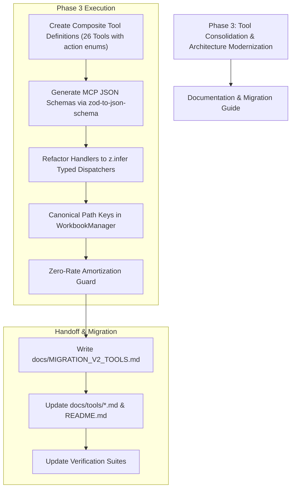

# Excel MCP Server — Active Project Audit & Roadmap Report

> **Evaluation Date**: October 2026  
> **Status**: Core Security, Mathematical, Validation & QA Foundations Resolved  
> **Evaluation Framework**: 6 Assigned Expert Personas ([docs/AI_WORKFLOW.md](AI_WORKFLOW.md))  
> **Target Audience**: AI Assistants (GitHub Copilot, Cline, Antigravity, Claude, ChatGPT), Lead Architects, and Developers.

---

## Executive Summary & Scorecard

Following remediation across Phase 1 and Phase 2, the core vulnerabilities (path traversal, IRR mathematical defects, lack of tests, and missing Zod runtime validation) have been resolved. The test suite now passes **123 tests across 7 test suites** with zero compiler or linter errors.

This document tracks the **remaining active findings and architectural tasks** required to achieve full production readiness.

### Active Status Scorecard

| Persona Lens | Domain | Current Status | Remaining Action Item |
| :--- | :--- | :---: | :--- |
| **Role 1: Solution Architect** | System Design & Modularity | ⚠️ PENDING CONSOLIDATION | Execute Phase 3 blueprint: Consolidate 127 granular tools into 26 composite tools ([PHASE3_CONSOLIDATION_PLAN.md](PHASE3_CONSOLIDATION_PLAN.md)). Fix basename key collision. |
| **Role 2: Senior Software Developer** | Code Quality & Architecture | 🟡 CLEAN (PHASE 3 PENDING) | Clean up Facade encapsulation (retire public sub-service exposures on `ExcelService`). |
| **Role 3: Senior QA & Test Engineer** | Testing & Verification | 🟢 STABLE (123 TESTS PASSING) | Maintain test coverage as Phase 3 composite tools are introduced. |
| **Role 4: Financial & Accounting Analyst** | Mathematical Correctness | 🟢 STABLE | Edge-case guard: handle zero-rate loan amortization (`annualRate = 0`). |
| **Role 5: System Security Specialist** | Access Control & Security | 🟢 HARDENED | Operator configuration: consider fail-closed default for empty `allowedPaths` in production profiles. |
| **Role 6: Senior Excel & Doc Specialist** | Excel Domain & Docs | 🟡 PENDING DOCS OVERHAUL | Overhaul documentation and tool catalogs once composite tools (Phase 3) are merged. |

---

## Active Findings & Next Actions

---

### 🏛️ Role 1: Expert Software Solution Architect

#### Active Finding 1.1: Context Window Bloat via 127 Granular Tools (HIGH)
- **Current State**:
  All 127 defined tools are currently active and dispatched. While fully functional, sending 127 tool schemas in `ListToolsRequest` imposes ~38,000 tokens of overhead on every client session, slowing response latency and increasing tool selection confusion for LLMs.
- **Action Plan**:
  Execute the approved blueprint in [docs/PHASE3_CONSOLIDATION_PLAN.md](PHASE3_CONSOLIDATION_PLAN.md) to merge 127 tools into **26 composite tools** using `action` enums.
  - Expected token reduction: ~75% (~38k down to ~7–9k tokens).
  - Target: Dedicated migration session with backward compatibility or migration guide.

#### Active Finding 1.2: Workbook Map Basename Key Collision (MEDIUM)
- **File**: [`src/services/excel-workbook-manager.ts`](../src/services/excel-workbook-manager.ts#L255-L258)
- **Current State**:
  While source paths are now recorded for default saves, `activeWorkbooks` still indexes workbooks by filename basename (`report.xlsx`). Opening two different files with the same name from separate folders (`/dirA/report.xlsx` and `/dirB/report.xlsx`) causes a key collision in memory.
- **Action Plan**:
  Switch `activeWorkbooks` keys to canonical absolute paths, while providing fuzzy basename resolution when unique.

#### Active Finding 1.3: Encapsulation Leak in Facade Pattern (LOW)
- **Files**: [`src/services/excel-service.ts`](../src/services/excel-service.ts#L29-L32), [`src/tools/tool-handler.ts`](../src/tools/tool-handler.ts#L56-L59)
- **Current State**:
  `ExcelService` exposes sub-services as public properties (`public accounting`, `public advancedAccounting`, `public formulaAnalyzer`).
- **Action Plan**:
  Make sub-service fields private and route all external interactions through explicit Facade methods or inject domain services directly into handlers during Phase 3 tool rewrite.

---

### 📈 Role 4: Financial & Accounting Data Analyst

#### Active Finding 4.1: Edge-Case Guard in Loan Amortization (LOW)
- **File**: [`src/services/excel-advanced-accounting.ts`](../src/services/excel-advanced-accounting.ts#L238)
- **Current State**:
  When `annualRate = 0` (zero-interest loan), the standard amortization formula divides by zero (`(1+r)^n - 1 = 0`), producing `NaN` payment values.
- **Action Plan**:
  Add zero-rate branch: if `annualRate === 0`, `payment = principal / numberOfPeriods`, with zero interest allocated across periods.

---

### 🛡️ Role 5: System Security Specialist

#### Active Finding 5.1: Operator Profile Default-Deny Configuration (LOW)
- **File**: [`src/security/permission-checker.ts`](../src/security/permission-checker.ts#L32-L35)
- **Current State**:
  When `allowedPaths` is empty `[]`, `PermissionChecker` allows all paths by default (except denied patterns).
- **Action Plan**:
  In server configuration profiles (`ServerConfig`), default unconfigured deployments to `process.cwd()` to enforce strict default-deny containment unless explicitly opted out by the operator.

---

## Actionable Execution Roadmap (Remaining Work)



---

## Current Verification Status

Run these commands to verify the current health of the codebase:

```bash
# 1. Run all 123 automated tests across 7 test suites
npm test

# 2. Verify ESLint compliance (zero errors)
npm run lint

# 3. Verify TypeScript build compilation (zero errors)
npm run build

# 4. Check active tool count (127 live tools)
node -e "import('./dist/tools/tool-definitions.js').then(m => console.log('Tools count:', m.TOOL_DEFINITIONS.length))"
```
